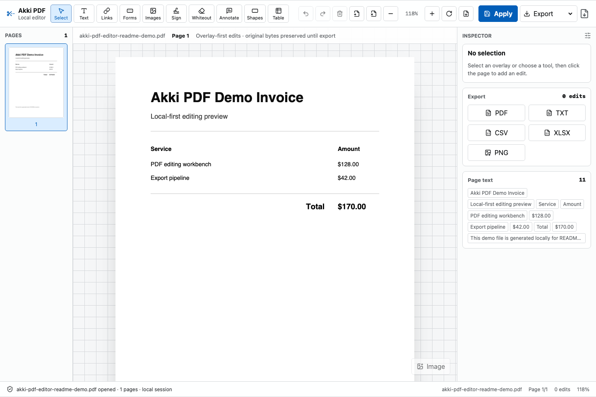

# Akki PDF Editor

Local-first PDF editor workbench inspired by Sejda's import, edit, apply, and export flow. Files stay in the browser; edits are modeled as overlays until export so the original PDF bytes are preserved during the editing session.




## Features

- Import PDFs from disk or create a blank document.
- Render pages with PDF.js and keep page thumbnails, zoom, rotation, and page controls in one workbench.
- Manage pages from the thumbnail rail: insert blank, delete, duplicate, reorder (buttons or drag), rotate, extract a page to a new PDF, and merge another PDF in — overlay edits are remapped to follow their pages.
- Add overlay edits: text, whiteout, links, forms, images, signatures, annotations, shapes, and table regions.
- Click existing PDF text in Select mode to create a replacement overlay with closest-match font styling.
- Inline Sejda-style toolbar for selected objects, including searchable font family picker with keyboard support.
- Export edited PDF, TXT, CSV, XLSX, and PNG locally.

## Tech Stack

- React + Vite + TypeScript
- PDF rendering: `react-pdf` / PDF.js
- PDF writing: `pdf-lib` + `@pdf-lib/fontkit`
- Spreadsheet export: minimal OOXML writer built with `fflate` (no SheetJS dependency)
- UI icons: `lucide-react`
- Font picker: `react-select`
- Tests: Vitest + Playwright
- Lint/format: ESLint + Prettier

## Run Locally

This project uses **bun** (Node 20+). Do not mix package managers.

```bash
bun install
bun run dev
```

Open [http://localhost:5173](http://localhost:5173).

## Test And Build

```bash
bun run typecheck
bun run lint
bun run test
bun run build
bun run e2e
```

## Deploy

Deployed as a static SPA on Vercel. `vercel.json` sets the build command (`bun run build`),
output directory (`dist`), security headers (including a Content-Security-Policy tuned for
the PDF.js worker/WASM), and long-lived caching for the copied `/pdfjs/*` assets. The Node
version is pinned via `.nvmrc` / the `engines` field.

## Project Shape

- `src/engine/` hides PDF loading, page sizing, text extraction, writing, and export adapters.
- `src/state/` contains the edit reducer for operations, selection, undo, and redo.
- `src/editor/` contains operation factories, page operation helpers, selection behavior, and tool registry.
- `src/components/` contains the workbench UI: tool hub, ribbon, canvas, thumbnails, inspector, status bar, and inline toolbar.
- `src/styles/tokens.css` and `src/styles/app.css` define the Hallmark-audited workbench design system.

## Notes

V1 uses professional overlay replacement instead of fragile direct rewriting of arbitrary PDF text streams. When an original embedded font cannot be reused, the app resolves the closest available family and exports with that replacement.
