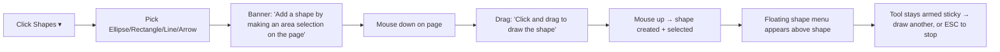

# Sejda Shapes Toolbar Parity

Reference: https://www.sejda.com/pdf-editor (live editor, inspected 2026-06-22)
Related: [`007-sejda-font-replacement-parity.md`](007-sejda-font-replacement-parity.md), root [`plan.md`](../plan.md)

This is a **research/reference note** captured by driving the live Sejda editor (DOM +
CSS + i18n strings inspected via CDP). It documents how every top-toolbar tool announces
itself and, in depth, how the **Shapes** tool works, so we can mirror the UX in Akki. No
Akki code is changed by this note — section F lists the concrete follow-ups.

---

## A. The top toolbar (left → right)

Sejda's editor toolbar (`#tools-menu`, each button carries `data-tool="…"`):

| Order | Tool | `data-tool` | Type | Dropdown? |
|-------|------|-------------|------|-----------|
| 1 | Text | `text` | toggle | split (Find & Replace) |
| 2 | Links | `link` | region | no |
| 3 | Forms | `form` | menu | yes (field types) |
| 4 | Images | `image` | menu | yes (New Image / Delete / New Stamp) |
| 5 | Sign | `sign` | menu | yes (New Signature) |
| 6 | Whiteout | `whiteout` | region | no |
| 7 | Annotate | `annotate` | menu | yes (Strike/Highlight/Underline/Freehand/Draw) |
| 8 | **Shapes** | `shape` | **menu** | **yes (Ellipse / Rectangle / Line / Arrow)** |
| 9 | Undo | `undo` | action | no |
| — | Apply changes | — | action | (commits edits, then Download) |

When a tool is active its button gets classes `active active-sticky` (sticky = stays armed
for repeated placement until you switch tools or press ESC).

---

## B. Per-tool activation hint (the black banner)

Every tool shows a single-line hint banner across the top of the page area the moment it is
armed. These are the exact i18n strings pulled from the live DOM:

| Tool | Armed hint | While dragging / extra |
|------|-----------|------------------------|
| Text | `Click existing text to edit or click the page to add new text` | `Drag text with your mouse to move it` |
| Links | `Add links by making an area selection on the page` / `Select a page area to create link` | — |
| Forms | `Click on the page to place symbol` | `Tap again to place element on page` |
| Images | `Click a location on the page to add image` | — |
| Sign | `Click a location on the page to add signature` | `Click to place signature` |
| Whiteout | `Select page area to whiteout` | — |
| **Shapes** | **`Add a shape by making an area selection on the page`** | **`Click and drag to draw the shape`** / **`Select area to draw the shape`** |
| Attachment | `Click a location on the page to add attachment` | — |

Shared / edge-case strings:

- `Press ESC to cancel` — shown while a placement/draw is in progress.
- `Looks like you clicked outside the page? Please try clicking a location inside the page` —
  if the click/drag starts off-page.
- `ESC to cancel`, `Selected {} objects`, `Moving {} objects` — multi-select + drag feedback.

Two interaction archetypes emerge, and **Shapes is the area-selection archetype**:

1. **Point placement** — Text, Images, Sign, Forms, Attachment → single click drops the element.
2. **Area selection (drag)** — Links, Whiteout, **Shapes** → click-drag a rectangle to define bounds.

---

## C. Shapes — deep dive

### C.1 The dropdown

`button[data-tool="shape"]` opens `ul.dropdown-menu.shape-opts` with exactly **four**
`a.shape-opt` items, each with a small glyph icon, in this order:

```
Ellipse   ○
Rectangle ▢
Line      ╱
Arrow     ↗
```

There is **no separate "Circle"** — a circle is just an Ellipse dragged to equal width/height.
Picking an item arms that shape type; the toolbar button then remembers it (split-button
behavior) so clicking the main button re-arms the last-used shape.

### C.2 Drawing flow



- The shape is created **only on drag** (area selection), not a single click.
- On release the new shape is auto-selected and the per-shape floating menu opens.
- The tool is **sticky** — you can immediately draw another shape; **ESC** exits.

### C.3 Rendered DOM model (confirmed live)

A rectangle drawn on the page:

```html
<div class="shape-editable ui-draggable ui-draggable-handle ui-resizable active shape-rectangle"
     id="shape-editable-0"
     style="border-width: 3.88px; border-color: rgb(255,0,0);
            background-color: rgba(0,0,0,0); border-style: solid;
            width: 75px; height: 82px;
            position: absolute; top: 433px; left: 1007px;">
  <div class="ui-resizable-handle ui-resizable-n"></div>  <!-- n e s w + 4 corners -->
  …
</div>
```

Key facts:

- **Rectangle & Ellipse render as a styled `<div>`** — CSS `border-width` / `border-color` /
  `border-style: solid` for the stroke, `background-color` for the fill. (Ellipse adds an
  inline `border-radius: 50%`; it is not in the static CSS, so it is applied inline by JS.)
- **Line & Arrow render via SVG** and carry the `line-editable` class instead (separate from
  the box-model `shape-rectangle`/`shape-ellipse`). The arrowhead is part of the SVG path.
- Geometry (`left/top/width/height`) is stored in **page-local coordinates**, not viewport
  coordinates. (Measured: `style.left=1007` while the element's viewport rect was `x=1540`,
  because the page itself is offset inside `#edit-pages`.) Border width is stored scaled to
  the current zoom (`3.88px` here).
- Drag = jQuery UI `draggable`; resize = jQuery UI `resizable` with 8 handles
  (`ui-resizable-n/e/s/w` + corners). While dragging/resizing the dashed selection outline
  and handles are hidden (`.ui-draggable-dragging { outline: none }`).
  **⚠️ Akki note:** this is how *Sejda* does it — **do not copy jQuery UI**. Implement the
  equivalent drag/resize in React (see §F constraint).
- Selection affordance: `.shape-editable { border: 2px dashed transparent }`, and on
  `:hover`/`.active` the dashed outline turns Sejda blue (`rgb(2,130,229)`).

### C.4 The floating per-shape menu (`#shape-editable-menu`)

Appears anchored just above/beside the selected shape (`position:absolute; z-index:1000`).
Confirmed controls, in order:

| Control | DOM | Behavior |
|---------|-----|----------|
| **Border width** | `button[title="Border width"]` → `.dropdown-menu.border-size-opts` | ~8 preset widths (54px-wide mini menu) |
| **Border color** | `button[title="Border color"]` → swatch grid | ~80 preset `a.color-swatch` + hex + eyedropper |
| **Background color** | `button[title="Background color"]` → swatch grid | same swatch set, includes a "transparent/none" option |
| **Hex input** | `a.color-type-hex` (`title="Choose a color by hex code"`) | type a hex value |
| **Eyedropper** | `a.color-picker` (`title="Select a color from the document"`) | sample a color from the page |
| **Duplicate** | `button.clone-btn` (`title="Duplicate"`) | clones the shape with a small offset |
| **Delete** | `button.delete-opts` (`title="Delete"`) | removes the shape |

So a shape's editable properties are exactly: **stroke width, stroke (border) color,
fill (background) color, duplicate, delete.** Both color pickers offer presets + hex +
document eyedropper.

### C.5 Defaults (observed)

- Border (stroke): red `rgb(255,0,0)`, `border-style: solid`.
- Border width: ~3.9px at the test zoom (a small fixed PDF-unit width scaled to zoom).
- Fill (background): transparent `rgba(0,0,0,0)`.

### C.6 Related/edge behaviors

- **Whiteout is a shape under the hood**: `div.shape-editable.whiteout` (white fill, area
  selection). Hint: `Whiteout hides but will not completely remove underlying text or images.
  Not suitable for redacting sensitive data`.
- Rotated pages: shapes/annotations on rotated pages are partially unsupported
  (`Sorry, adding annotations on rotated pages is not yet supported`).
- Shape labels surfaced in the undo/history list: `Rectangle`, `Ellipse`, `Line`, `Arrow`,
  `Whiteout`.

---

## D. How the other tools behave (quick reference)

- **Text** — toggle tool (not sticky-armed for area). Click existing PDF text → in-place edit;
  click empty page → new text box. Style toolbar: bold, italic, font family/size, color,
  link, move, clone, delete. (Detailed separately in plan 007.)
- **Links** — area selection → link properties modal (external URL / email / phone / internal
  page). Akki already routes these through `sanitizeUrl`.
- **Forms** — menu of field types (Text, Multiline, Dropdown, Radio, Checkbox, Signature box);
  point placement, then name/value prompt; has a separate "edit fields" vs "fill" mode.
- **Images** — menu: New Image (file) / Delete existing / New Stamp; point placement, drag to
  move, corner resize.
- **Sign** — menu: New Signature (Type / Draw / Upload Image / Camera); point placement.
- **Whiteout** — area selection white rectangle (see C.6).
- **Annotate** — menu: Strike out / Highlight / Underline / Freehand / Draw; text-selection
  or freehand depending on sub-tool.

---

## E. Sejda vs Akki — shapes gap matrix

Akki already models shapes (`src/types/editor.ts`, `src/editor/toolRegistry.ts`):

- `ShapeOperation = { type:"shape"; kind:"rectangle"|"ellipse"|"line"|"arrow"; stroke; fill?; strokeWidth }`
- Tools `shape` / `shape-ellipse` / `shape-line` / `shape-arrow`, all `placement: "region"`
  (drag-to-draw), grouped under a `shapes` hub with `primary: "shape"` — matching Sejda's
  4-item dropdown and area-selection archetype.

| Capability | Sejda | Akki today | Gap |
|------------|-------|------------|-----|
| Shape types | Ellipse, Rectangle, Line, Arrow | same 4 (`ShapeKind`) | ✅ parity in model |
| Activation hint banner | per-tool single-line hint (B) | verify Akki shows equivalent region hint | check |
| "Add a shape by making an area selection on the page" | yes | confirm exact copy | wording |
| Drag-to-draw (area) | yes | `placement:"region"` | ✅ |
| Sticky re-arm after draw | yes (`active-sticky`) | confirm | check |
| ESC to cancel | yes | confirm | check |
| Auto-select + floating menu on create | yes | confirm inline toolbar opens | check |
| Stroke width control | preset dropdown | `strokeWidth` exists — confirm UI control | check UI |
| Stroke color | swatches + hex + eyedropper | `stroke` exists — confirm picker + eyedropper | likely gap (eyedropper) |
| Fill color (+ none) | swatches + hex + eyedropper | `fill?` exists — confirm + transparent option | likely gap |
| Duplicate | yes | confirm clone affordance for shapes | check |
| Delete | yes | yes (generic) | ✅ |
| Resize handles (8-pt) | jQuery UI resizable | confirm Akki resize for line/arrow endpoints | check (line endpoints) |
| Line/Arrow as endpoint-draggable | SVG with handles | confirm Akki line/arrow editing | check |
| Defaults | red 3.9px stroke, transparent fill | define matching defaults | align |

---

## F. Follow-ups (when we mirror this in Akki)

1. **In-page hint banner (required)** — show the message **on the page itself** (a banner
   pinned to the top of the page area, exactly like Sejda) so the user knows how to perform
   the action. It must update between states: armed → `Add a shape by making an area
   selection on the page`, then during drag → `Click and drag to draw the shape`. Also wire
   the off-page (`Looks like you clicked outside the page? …`) and `Press ESC to cancel`
   hints. Use the exact copy from §B. This is a real React component overlaying the canvas,
   driven by the active-tool + drag state — not a tooltip.
2. **Floating shape menu parity** — Border width, Border (stroke) color, Background (fill)
   color, Duplicate, Delete — each color control with presets **+ hex input + document
   eyedropper**, and fill must offer a transparent/none option.
3. **Sticky tool** — keep the shape tool armed after a draw for rapid repeat; ESC exits.
4. **Defaults** — red `#FF0000` solid stroke, ~thin width scaled to zoom, transparent fill.
5. **Line/Arrow editing** — render as SVG with endpoint handles (not just a bounding box);
   arrowhead baked into the path.
6. **Coordinate model** — store shape geometry in page-local space and scale stroke width by
   zoom on render (Akki overlay already works in page space — keep consistent on export).
7. **Whiteout** — treat as a shape variant (white fill) for code reuse, matching Sejda.

### ⚠️ Implementation constraint — React only, no jQuery

Sejda's shapes rely on **jQuery + jQuery UI** (`ui-draggable`, `ui-resizable`). **Do NOT port
that.** Akki is a React 18 + TS app with no jQuery dependency, and we are keeping it that way.

- Implement drag/move and resize with **React** — pointer events (`onPointerDown/Move/Up`
  with `setPointerCapture`) plus React state, the same pattern Akki's existing overlays
  already use (`OperationOverlay` / `PdfCanvas` drag + resize handles). Reuse those, don't add
  a new dependency if the existing hooks cover it.
- If a helper is genuinely warranted, only consider a **React-native** library
  (e.g. `@dnd-kit`, `react-rnd`) — **never** jQuery UI or anything that touches the DOM
  outside React's render tree. Confirm with the owner before adding any dep.
- Render the shape itself as a React component: rectangle/ellipse as a styled `div`
  (border + `border-radius:50%` for ellipse via inline style/`style` prop), line/arrow as an
  inline `<svg>`. Selection handles are React elements, positioned from state — no
  `ui-resizable-handle` DOM injection.
- Geometry stays in React state / the `editModel` reducer (`ShapeOperation`), not in DOM
  attributes mutated imperatively.

---

## G. Method / evidence

Inspected the live editor with a PDF already loaded (Apoteket receipt). Confirmed via Chrome
DevTools Protocol:

- Toolbar buttons + `data-tool` attributes and the `shape-opts` dropdown (Ellipse/Rectangle/
  Line/Arrow).
- A real `div#shape-editable-0.shape-rectangle` outerHTML + inline style (border/fill/size,
  page-local `left/top`).
- The `#shape-editable-menu` button set (Border width / Border color / Background color /
  hex / eyedropper / Duplicate / Delete).
- Stylesheet rules for `.shape-editable`, `.line-editable`, `.shape-editable.whiteout`,
  resize handles, and selection outline.
- The full set of armed/drag hint strings enumerated from the DOM.

Not exercised live (trusted-input drawing is restricted in the harness): the byte-level
export of each shape and the exact preset width/swatch values — those are inferred from the
DOM/CSS and Sejda's i18n strings and should be confirmed if we need pixel-exact parity.
